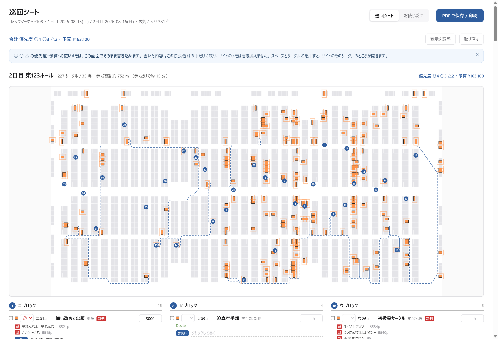
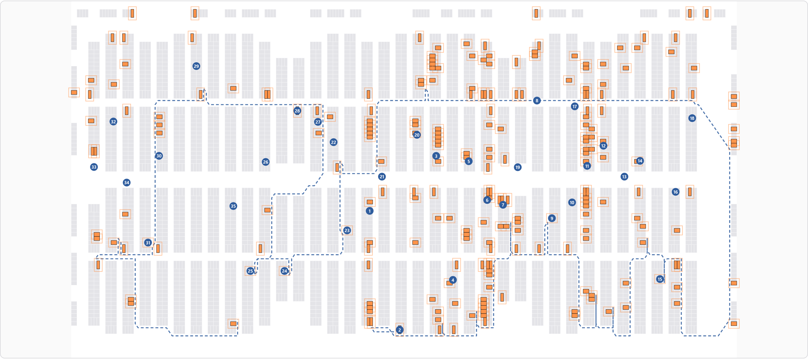
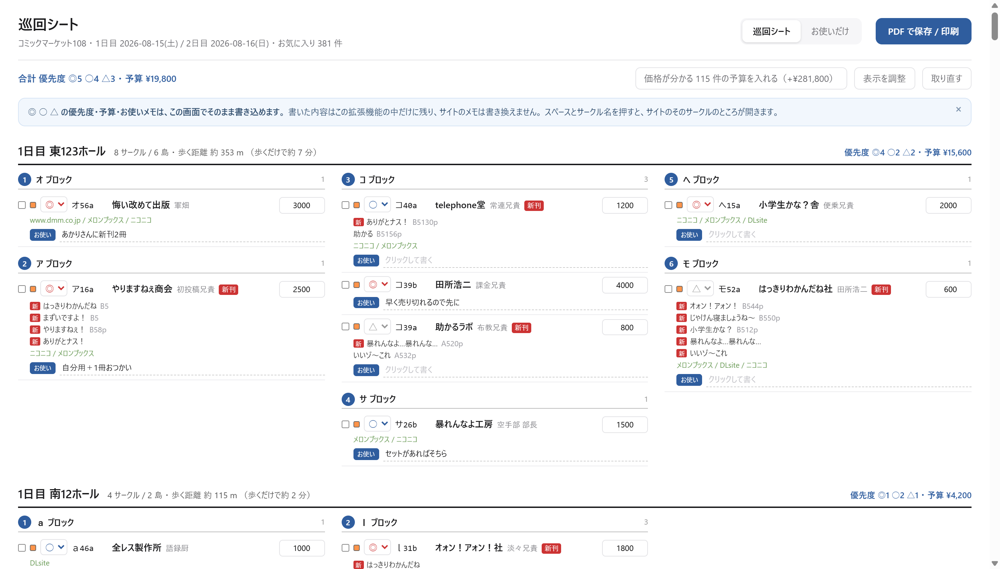
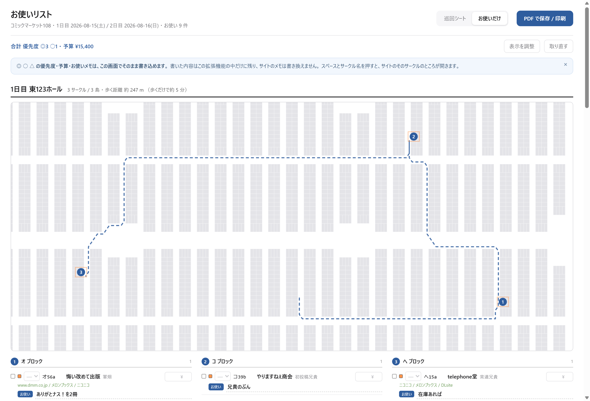
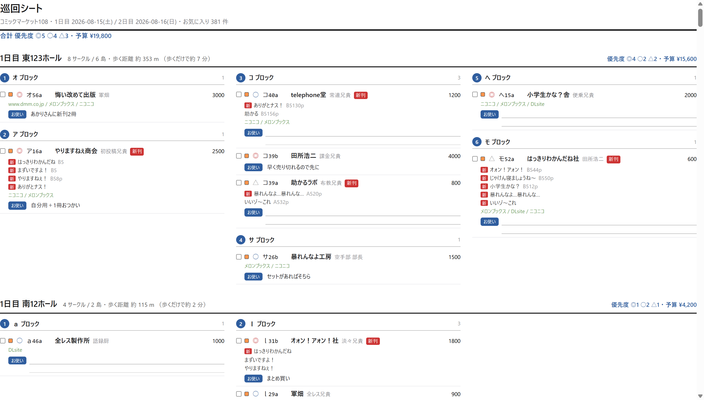
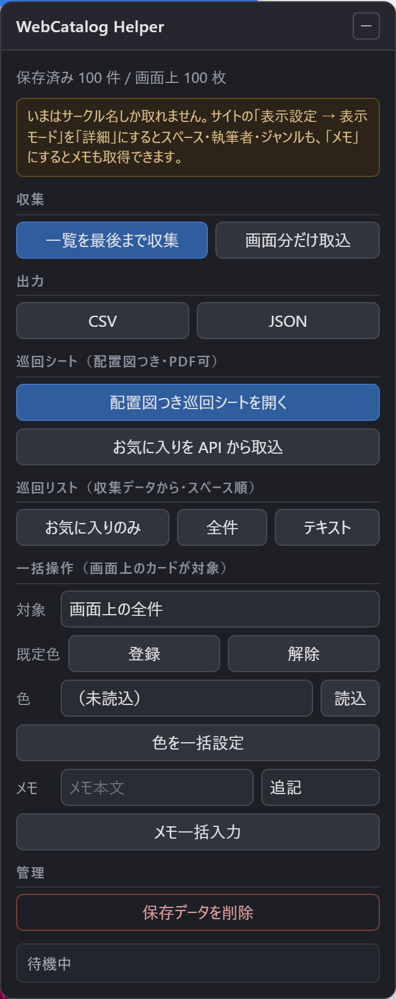
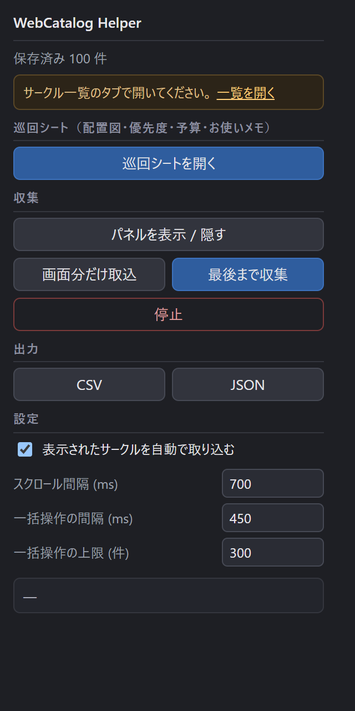

# WebCatalog Helper

[webcatalog.circle.ms](https://webcatalog.circle.ms/circle/list) のサークル一覧を扱いやすくする Chrome / Firefox 拡張。

- サークル情報の収集と CSV / JSON 出力
- お気に入りの一括登録・解除・色設定、メモの一括入力
- スペース順に並べ替えた巡回リストの生成（印刷用ページ / テキスト）

ビルド不要。素の JavaScript と Manifest V3 のみで、Chrome と Firefox の両方を同じソースで読み込む。

## 画面

お気に入りを実際の座標に載せて、配置図と巡回順とチェックリストを1枚にまとめる。



配置図はスペースの矩形座標から起こした SVG。灰色が全スペース、色が付いているのがお気に入りで、破線が巡回順、丸数字が島の順番。破線は通路のマスを辿っているので、机の上は横切らない。



1件ごとに 優先度（◎ 高 / ○ 中 / △ 低）・予算・お使いメモを書き込める。頒布物と書店の新着も並ぶ。



「お使いだけ」に切り替えると、お使いメモを書いたサークルだけのシートになる。配置図・巡回順・合計もその分で計算し直す。配置図は対象が入る範囲に自動で寄る。



印刷すると入力欄の枠が消え、優先度は記号だけになり、書いていないお使いメモは手書き用の罫線になる。そのまま「PDF に保存」で PDF になる。



サークル一覧のページに出る操作パネル。収集・出力・一括操作はここから。



ツールバーのアイコンから開くポップアップ。巡回シートはここからも開ける。



> スクリーンショットのサークル名・執筆者名・頒布物名は、実在のサークルと紛れないよう、ひと目でダミーと分かる文字列に差し替えてある。配置図の形・スペースの位置・巡回経路・件数は実データのまま。

## 読み込み方

### Chrome / Edge

1. `chrome://extensions` を開く
2. 右上の「デベロッパー モード」をオン
3. 「パッケージ化されていない拡張機能を読み込む」でこのフォルダを選択

### Firefox

1. `about:debugging#/runtime/this-firefox` を開く
2. 「一時的なアドオンを読み込む」で `manifest.json` を選択

一時的なアドオンは Firefox を閉じると消える。恒久的に入れたい場合は署名が必要。

> Firefox は 128 以降が必要。`world: "MAIN"` のコンテンツスクリプト（API フック）がそれ以前では効かない。
> 128 未満でも DOM からの収集は動く。

## 使い方

サークル一覧を開くと、右下に操作パネルが出る。ツールバーのアイコンからも同じ操作ができる。

### 先に表示モードを合わせる

**サイト側の「表示設定 → 表示モード」で取れる情報が変わる。** カードに描画されていない列は取りようがない。

| 表示モード | カードに出る列 |
| --- | --- |
| Web（既定） | サークル名のみ |
| 詳細 | サークル名 / 執筆者 / スペース / ジャンル |
| メモ | 詳細 + メモ |
| 本 | なし（カットのみ） |

スペースや執筆者も欲しいなら「詳細」か「メモ」にしてから収集する。Web モードのままだとパネルにその旨の注意が出る。

### 収集

| 操作 | 内容 |
| --- | --- |
| 画面分だけ取込 | いま DOM 上にあるカードを保存する |
| 一覧を最後まで収集 | ページ末尾の読み込みトリガまで自動スクロールしながら収集する |

一覧はページャではなく無限スクロールなので、「最後まで収集」は末尾センチネルを可視域へ送る動作を繰り返し、新着が出なくなったら止まる。件数が多いときは数分かかる。途中で「停止」を押せばそこまでの分が残る。

設定の「表示されたサークルを自動で取り込む」を有効にしておくと、普通に一覧を眺めているあいだも裏で溜まっていく（既定で有効）。

収集結果は `wcid` をキーにマージされる。あとから取れた項目（配置公開後のスペース番号など）で上書きされ、空の値で既存が消えることはない。ページを移動しても、絞り込み条件を変えても積み上がる。

### 出力

CSV は UTF-8 BOM 付き・CRLF なので Excel でそのまま開ける。列は以下:

```
wcid, スペース, 地区, ホール, ブロック, 番号, 枝番, サークル名, 執筆者,
ジャンル, お気に入り, 色番号, メモ, カット画像URL, 詳細URL, 取得日時
```

### 配置図つき巡回シート（PDF）

**どこから開くか**

- ツールバーの拡張機能アイコン → **「巡回シートを開く」**（サイトを開いていなくても出せる）
- または一覧ページ右下のパネル →「配置図つき巡回シートを開く」

拡張機能のページとして開くので、書き込んだ内容が保存され、リロードしても消えない。

**中身**

- **実際の会場配置図**（スペースの矩形座標から起こした SVG。画像タイルではないので拡大しても潰れず、PDF にしても軽い）
- お気に入りをお気に入り色で塗り、周囲に色枠を重ねて見つけやすくしたもの
- 巡回順を結んだ経路線と、島ごとの順番バッジ
- 島ごとのチェックリスト。1件につき チェック欄 / 色 / **優先度** / スペース / サークル名 / 執筆者 / 新刊マーク / **予算** / 頒布物 / 書店 / サイトのメモ / **お使いメモ**

**書き込める欄**（いずれもこの拡張の中だけに保存され、サイト側のメモには影響しない）

| 欄 | 内容 |
| --- | --- |
| 優先度 | ◎ 高 / ○ 中 / △ 低。◎ だけに絞ってから印刷できる |
| 予算 | サークルごとの見込み額。エリア小計と全体合計が自動で出る |
| お使いメモ | 「誰に何を何冊」など。空のままにすると紙に手書きできる罫線が入る（行数は変更可） |

**価格は取れる。** 頒布物には `price` が入っていて、実データでは 13,838 件のうち 11,199 件に価格があった。ただし `priceDisplay` が「サークルが価格を出すかどうか」の指定で、これが false のもの（2,195 件）は値段があっても伏せている。拡張はその指定に従い、出しているぶんだけを表示・集計に使う。

価格が分かるサークルは予算欄に目安が薄く出る。バーの**「価格が分かる N 件の予算を入れる」**を押すと、まだ空の欄だけまとめて埋まる（実データでは 381 件中 111 件・計 ¥294,000 が一度に入った）。埋めたあとも1件ずつ直せる。

**スペースとサークル名を押すと、サイトでそのサークルの詳細が開く。** 配置スペース・ホール・ジャンル・著者・サークルコメント・SNS・新着情報まで出る画面。開く先は1枚のタブを使い回すので、次々に押してもタブが増えない。

**「お使いだけ」に切り替えると、お使いメモを書いたサークルだけのシートになる。** 配置図・巡回順・予算合計もその分だけで計算し直すので、頼まれたぶんだけ持って回れる。

ページ右上の「PDF で保存 / 印刷」を押すとブラウザの印刷ダイアログが出るので、送信先を「PDF に保存」にすれば PDF になる。A4 横で組んである。印刷時は入力欄の枠が消え、優先度は記号だけ、未記入の予算とお使いメモは手書き用の下線・罫線になる。

配置図は、お気に入りと経路が入る範囲に自動で寄る。数件しか無いときにホール全体を出すと余白だらけで読めないため。

### サークル情報の保存

パネルの**「お気に入りを API から取込」**で、一覧・詳細に出てくる情報をまとめて保存できる。詳細ダイアログは別 API を呼んでおらず、`/api/v3/Circle/Search` の1レコードに表示に必要なものが全部入っている。

保存・出力される内容:

- 名前 / 執筆者 / 配置 / ジャンル名 / 配置表記 / 更新日時
- **頒布物**（`publishingBookInfos`）— 頒布物名・判型・ページ数・**価格**・新刊かどうか・説明・タグ
- **書店や pixiv の新着**（`externalNewImages`）— サービス名・見出し・リンク
- サークルカット / Web カットの画像 URL
- 優先度・予算・お使いメモ

実データ 300 件での充足率は 名前・配置・ジャンルが全件、執筆者 294、外部新着 266、頒布物 94、お品書き画像 45。頒布物レコード全 13,838 件のうち 価格あり 11,199・価格を公開しているもの 9,004。

#### 巡回順の決め方

ブロック名の五十音順ではなく、実際の座標と**通路**を使って組み立てている。

1. 配置図の矩形から「机が置いてあるマス＝通れない / それ以外＝通路」の盤面を作る
2. 日 × エリア（東123 / 東7 / 西12 / 南12）に分ける
3. 同じブロックのお気に入りを島にまとめ、その島の前に立てる通路のマスを求める
4. 島どうしの距離を**通路上のダイクストラ**で測る（斜め移動あり、机の角のすり抜けは禁止）
5. その距離行列で最近傍法 → 2-opt
6. 島の中は、前の島から入ってきた側に近い端から順に並べる（蛇行）

地図に描く線も、島の重心どうしを結んだ直線ではなく通路のマスを辿った線。**机の上を横切らない。**

入口の位置は API から取れないので、南側の端を起点とみなしている。

ヘッダには歩く距離と、歩くのにかかる時間の目安を出す。距離は「スペース1つ＝約 0.9 m」、時間は「人混みを時速 3km」として換算したもので、並ぶ時間は含まない。通路を通る前提で測っているので、直線で測った値よりかなり長く出る（2日目 東123ホールで直線 496m に対し通路 752m）。

### 巡回リスト（収集データから）

DOM 収集した分をスペース順に並べただけの簡易版。配置図は付かない。API が使えないときのフォールバック。

### 一括操作

**対象は「画面上に表示されているカード」**であって、保存済みデータ全件ではない。先に絞り込みや自動スクロールで対象を画面に出しておくこと。

| 操作 | 内容 |
| --- | --- |
| 既定色で登録 / 解除 | ハートを1回押すだけなので速い。すでにその状態のカードは触らない |
| 色を一括設定 | メニューを開いて色を選ぶ。すでにその色のカードは触らない（押すと解除になるため） |
| メモ一括入力 | 追記 / 置換 / 試行のみ。メモ欄は登録済みのカードにしか無いので、未登録は自動で飛ばす |

いずれも件数上限（既定 300 件）と 1 件あたりの間隔（既定 450ms）を設定でき、いつでも停止できる。実行中はページを触らないこと。

## 内部 API

サイトが使っている API。すべて実際に叩いて確認したもの。認証は Bearer で、トークンは
`Cookie2Token` がログインセッションのクッキーから発行する（拡張はトークンを保存しない。
メモリ上で短時間だけ持つ）。

| メソッド | パス | 内容 |
| --- | --- | --- |
| POST | `/api/v2/Cookie2Token` | `scope=openid&grant_type=client_credentials` → `access_token` |
| GET | `/api/v2/User/Favorite?event_id=N` | `favorites[{wcid,circleId,color,memo,createdAt}]` |
| POST | `/api/v2/User/Favorite` | `{wcid,color,memo,event_id}` で登録・更新 |
| DELETE | `/api/v2/User/Favorite` | `{event_id,wcid:[…]}` で解除 |
| GET | `/api/v2/User/FavoriteColor` | 色番号と名前 |
| GET | `/api/v3/Circle/Search` | `count` は 5000 まで。`wcid,name,writer,day,block,space,hallNumber,genre,publishingBookInfos(価格込み)` |
| GET | `/api/v2/Event/Base?event_id=N` | `eventInfo{days,areas,genre}`。`with_circle=true` を付けると全サークル（8.5MB） |
| POST | `/api/v2/MapTilesLastModified` | `{event_id}` → 配置図の更新時刻 |
| GET | `/api/v2/MapTiles?path=tile256/minimap/…` | 配置図のジオメトリ |

踏みやすい点:

- **`isMain=true` を付けると2スペースサークルの副スペースが落ちる**（22854 → 21108）。
  お気に入りには副スペースの wcid も入るので、付けずに全件取る
- **配置図のキーは `{日}/{ブロック}{スペース}`**（例 `2/Ｖ01a`）。ホール番号ではない。
  東123ホールの1日目だけホール番号と日がたまたま一致するので、間違えても半分通ってしまう
- 配置図の座標はスペース1つを1とする格子単位。ピクセルにするには
  `minimapSizeSettings` の `SpaceWidth` / `SpaceHeight` を掛ける
- **`?wcid=` だけではそのサークルに飛べない。** wcid は一覧を絞る条件ではなく
  「そこへスクロールする」指定でしかないため、1ページ目(100件)に入っていないサークルには届かない。
  `keyword`（サークル名）・`day`・`block` で先に絞ってから `wcid` を渡す
- **詳細を開く URL は無い。** 詳細は一覧のカードのカット画像を押すと右から出るドロワーで、
  開いても URL は変わらない。さらにこの SPA は読み込み時に自分でクエリを書き直すので、
  URL のハッシュに目印を載せる手も使えない（消される）。拡張では開きたいサークルを
  バックグラウンドに預け、開いた先のコンテンツスクリプトが受け取ってカードを押している
- 頒布物の `price` は `priceDisplay` が true のときだけ表に出す。値段自体は入っていても
  サークルが伏せている場合がある
- 2スペースサークルをお気に入りに入れると**件数は2増える**。数えているのはサークルではなく
  スペース(wcid)なので、サイトの仕様どおり

## サイト構造のメモ

配信中の JS バンドル（Nuxt 3 / Vue 3 / Vuetify 3）を読んで確認した内容。該当コンポーネントは `AtomsTextWithLabel` / `MoleculesMenuFavorite` / `AtomsFavoriteColorPicker` / `MoleculesListCardCircleFavoriteMemo`。DOM が変わったら `src/content/selectors.js` を直せば大半は追従できる。

カード:

```html
<div class="circle-web-view" data-webcatalog-wcid="23016323">
  <span class="circle-update-dot">                 <!-- 更新あり -->
  <div class="card-item el-hover" role="button">   <!-- 左クリックで詳細、右クリックでお気に入りメニュー -->
    <button class="… menu-favorite">
    
  <div class="card-text information">              <!-- ここに列が並ぶ -->
```

`card-text.information` の中身は `TextWithLabel` の連なりで、順番は サークル名 → 執筆者 → スペース → ジャンル → メモ で固定。どれが出るかは表示モード次第。ラベルはどのモードでも既定で非表示なので、列の判別はラベル文字列ではなく並び順で行っている。

```html
<div class="circle-name"><div>
  <span class="font-weight-bold text-subtitle-1 mr-2 text-medium-emphasis">ラベル</span>
  <span class="text-on-surface single-line">本文</span>
</div></div>
```

お気に入りの状態は `MenuFavorite` がボタンの色とアイコンで出し分けている:

| 状態 | ボタンのクラス | アイコン |
| --- | --- | --- |
| 登録済み | `text-favorite{N}`（N が色番号） | 塗りハート `M12,21.35…` |
| 未登録 | `text-neutralBase` | 輪郭ハート `M12.1,18.55…` |

お気に入りメニューは `open-on-click=false` で、**左クリックでは開かない**。左クリックはその場でのトグル（未登録なら既定色で登録、登録済みで既定色と同じなら解除）。開くのは長押しか `contextmenu`。メニュー内の `.favorite-color-icon` が色ボタンで、押すと `changeFavorite(色, いま同じ色か)` が走るため、同じ色を押すと解除になる。メモはこのメニュー内の textarea で、blur で保存される。

一覧末尾の `.reveal-sentinel` が可視域に入ると次が継ぎ足される（ページャは無い）。

一覧 URL のクエリ:

| キー | 内容 |
| --- | --- |
| `keyword` | 検索語 |
| `day` | 日程 |
| `area` / `block` | 地区 / ブロック（`block` はカンマ区切り） |
| `genre` | ジャンル（カンマ区切り） |
| `pay` | 電子決済対応のみ |
| `favoriteMemo` | メモ付きのみ |
| `sort` | 0=日付 / 1=スペース / 2=スコア / 3=お気に入り |
| `page` | ページ番号 |
| `wcid` | 単一サークル指定 |
| `isSearchCircleName` / `isSearchAuthor` / `isSearchProductInfo` | 検索対象 |

## 検証の状況

実際のブラウザ（Playwright + Chromium）に拡張を読み込み、ログイン済みのアカウントで通して確認した。

| 項目 | 結果 |
| --- | --- |
| お気に入り判定 | 実データ 100 件で 未登録 99 = `text-neutralBase`＋輪郭ハート / 登録済 1 = `text-favorite1`＋塗りハート。判定規則どおり |
| 一括登録 → 解除 | パネルから実行し、API 上の件数が 420 → 422 → 420 と戻ることを確認（+2 は2スペースサークルのため） |
| 配置図つき巡回シート | お気に入り 381 件すべてに配置を解決、7 エリア分を生成。配置不明 0 件 |
| 優先度・予算・お使いメモ | シート上で入力 → リロード後も保持されることを確認。小計・合計も一致（¥3,000 + ¥1,500 = ¥4,500） |
| 優先度での絞り込み | ◎ のみ表示に切り替えて、対象だけが残ることを確認 |
| PDF | 生成したシートを A4 横で PDF 化（約 600KB〜1.7MB） |
| 経路が机を貫通しないか | 描いた線を全区間サンプリングして、スペースの矩形の内側を通っていないことを 7 エリアすべてで確認（貫通 0 箇所） |
| 価格 | 381 件中 111 件に公開価格があり、一括で予算に入れて ¥294,000。リロード後も保持 |
| サークルの詳細を開く | 2 件で試し、どちらもサイト側の詳細（配置・ホール・ジャンル・著者・コメント）が開くことを確認。連続で押してもタブは 1 枚のまま |
| お使いだけの表示 | お使いメモを書いた分だけに切り替わり、配置図・巡回順・合計もその分で計算し直されることを確認 |
| DOM スクレイパ | 保存済みの実 HTML（60 件 / 381 件）に jsdom を当てて抽出結果を確認 |

残っている未検証:

- **メモの一括入力は実行していない**。UI の構造と保存経路は配信バンドルで確認済みだが、
  実際に書き込むところまでは試していない。まず「試行のみ」モードと少数で確かめること
- 一括操作は UI を自動でクリックする方式。API を直接叩けば速いが、サイト側の状態と
  食い違わないよう UI 経由にしてある

## 構成

```
manifest.json
icons/
src/
  inject/net-hook.js     ページ本体(MAIN world)で fetch/XHR を包み、JSON を横流しする
  lib/space.js           スペース番号のパースと巡回順の比較
  lib/csv.js             CSV / JSON / 巡回テキストへの直列化
  lib/store.js           chrome.storage.local への保存とマージ
  lib/api.js             サイト内部 API のクライアント（トークン取得・お気に入り・配置図）
  lib/detail.js          一覧/詳細に出る情報（頒布物・書店リンク・カット）の取り出し
  lib/grid.js            通行可能マスの盤面と、その上でのダイクストラ・経路復元
  lib/plan.js            島のまとめ・通路上の距離での最近傍法と 2-opt
  lib/build.js           API からお気に入りを組み立てる（サイト側とシート側で共用）
  lib/render.js          配置図の SVG とチェックリストの描画
  content/selectors.js   ページ DOM に依存する定義（サイト更新時はまずここ）
  content/scrape.js      カード DOM / API JSON → レコード
  content/collect.js     オブザーバ・自動スクロール・API 受信
  content/bulk.js        お気に入り / メモの一括操作
  content/route.js       スペース順のグループ化（収集データからの簡易版）
  content/opendetail.js  シートから飛んできたサークルの詳細を開く
  content/panel.js       ページ上の操作パネル
  content/panel.css
  content/content.js     エントリポイント
  sheet/                 巡回シートのページ（優先度・予算・お使いメモを書ける）
  background/background.js
  popup/
```

巡回シートを拡張のページにしてあるのは、書き込んだ内容を `chrome.storage` に保存するため。サイトの上に作った blob ページだとリロードで消えてしまう。

拡張はサイトの表示内容を読み取り、一括操作のときだけサイトの UI を操作する。ログイン情報には触れず、保存先はブラウザのローカルストレージのみで、外部送信は一切しない。
